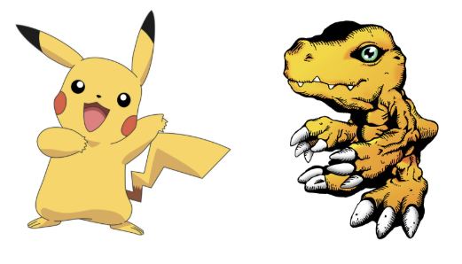
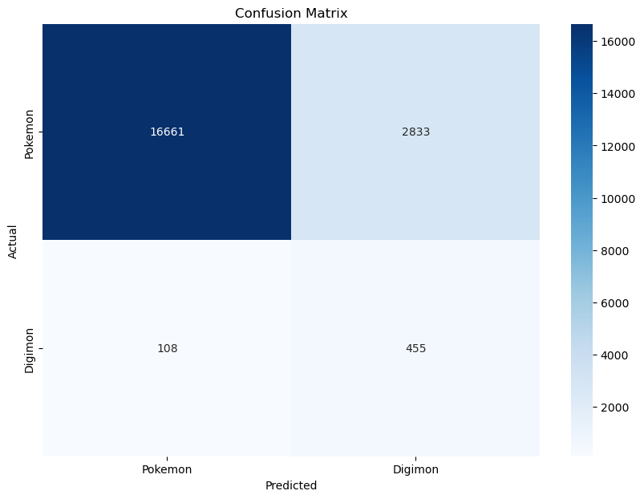
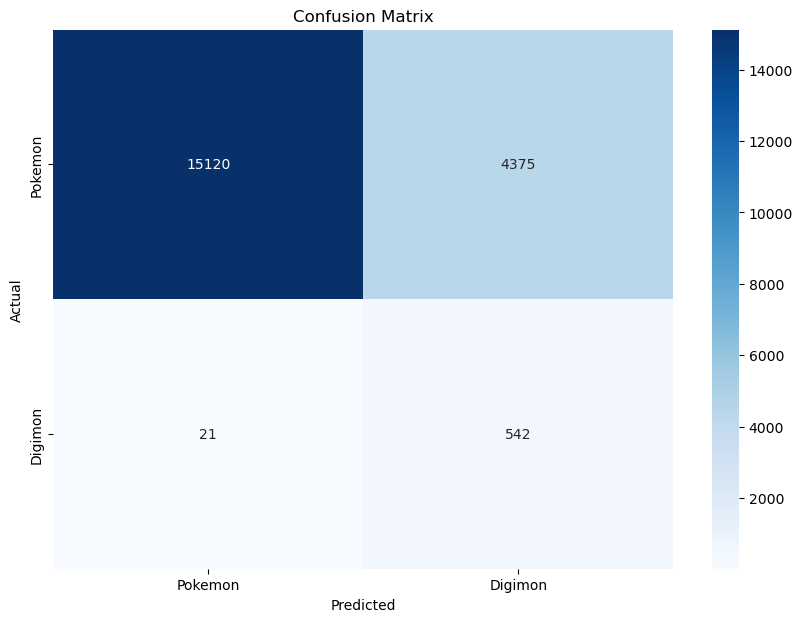
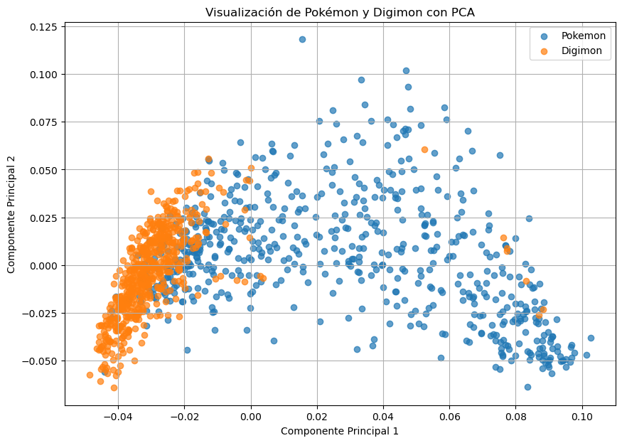
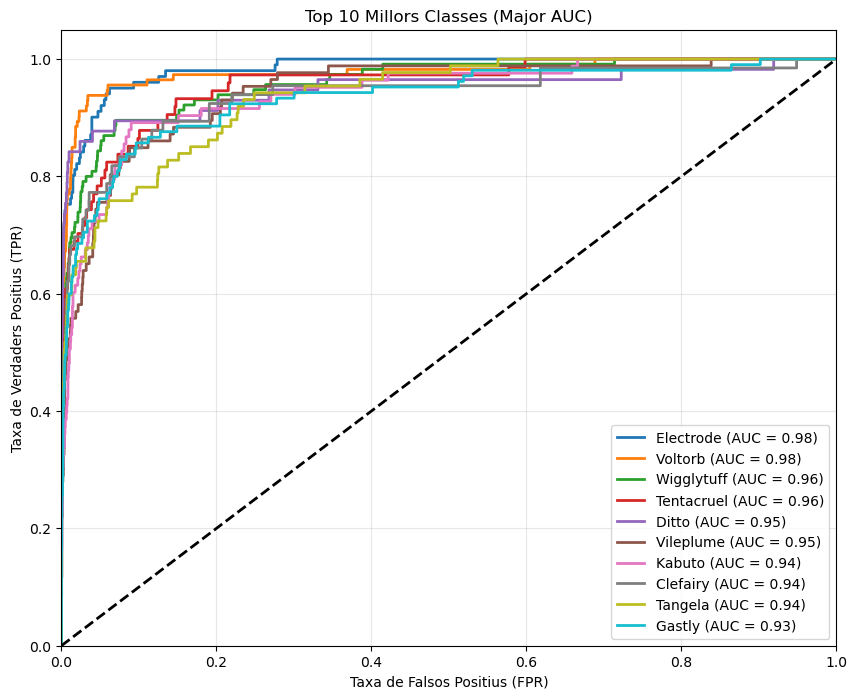
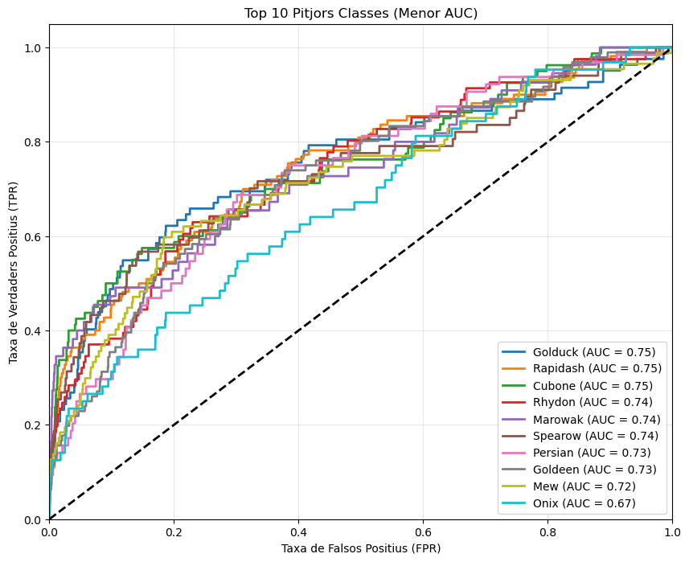

# Pokemon_Identifier
Python project about creating a program in order to identify the photos of a pokemon and digimon, classify pokemon depending on specie, and in the end, create a graph relating pokemons and digimons between them

Data obtainable from:
https://www.kaggle.com/datasets/bhawks/pokemon-generation-one-22k
https://drive.google.com/drive/folders/1tmcdsoX67NvmAgtmGJgo6kb3N6SlJeLu

## Key Objectives:
- Get predictions on which photo is a Pokemon or a Digimon.
- Predict which Pokémon appears in the photo.
- Get relations between Pokémon and Digimon to create a graph.

## Features
- **Bag of Visual Words**: This method is applied to extract features from the images.
- **Classifying methods**: In the notebook can be found the usage of Logistic Regression and SVM.
- **Results visualization**: The results are given with plots, so it is easier for the user to understand it.
- **Graphs**: Creation of a code to generate HTML codes to visualize Graphs.

## Results of the implementation

Here we can see results on the implementation of Bag of Visual Words on a Logistic Regression with SIFT

And here also an implementation on Bag of Visual Words on a Logistic Regression but now with Dense SIFT

Visualization on the distribution of the features between Pokemon and Digimon with PCA

Results on the best and worst Pokémon species with SVC

In order to get the final graphs, execute the whole code, and 2 graphs will appear in the directory automatically as HTML files.

